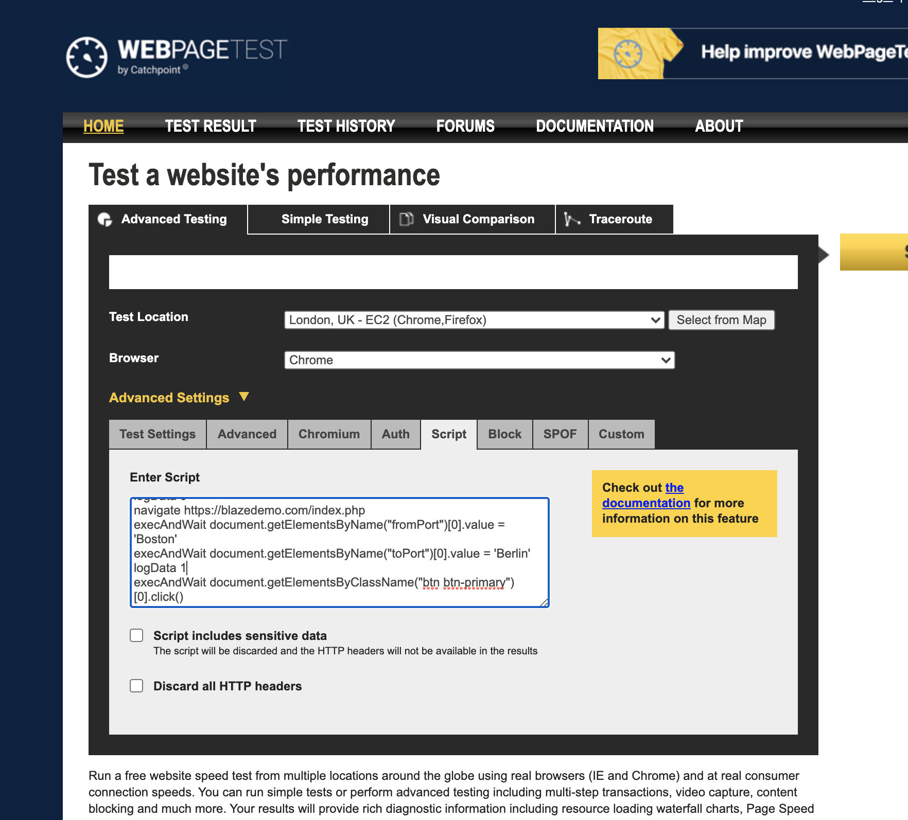
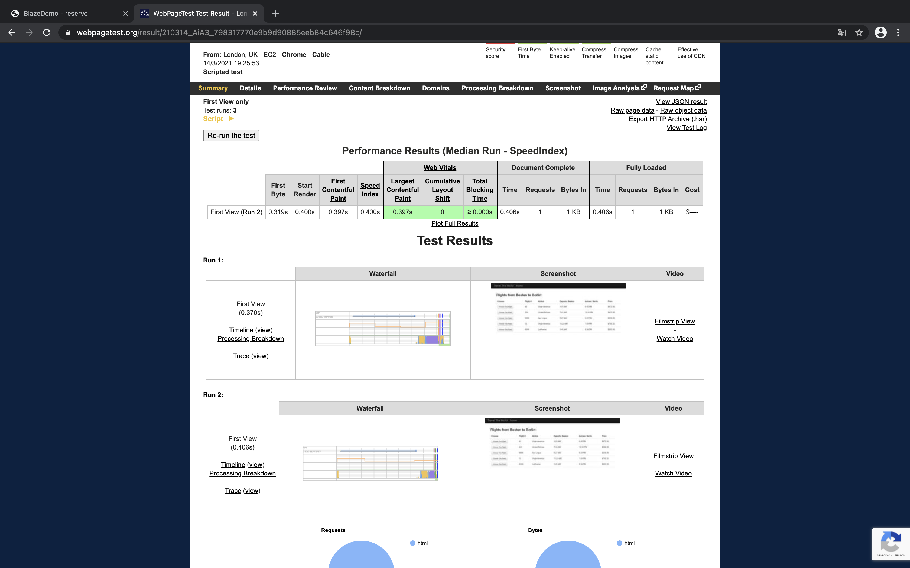

# Práctica IV · WebPageTest
Crear un script con WebPageTest para probar el rendimiento de la búsqueda.

* Usando javascript, añadir una prueba avanzada (en desktop Chrome) que haga una búsqueda
* Logear la página de resultado de búsqueda
* Hacer búsqueda en el selector de origen y destino sin usar el autocomplete

### Uso de la Herramienta 
####Nos dirigmos a:
```
https://www.webpagetest.org
```
#### y hacemos click en script



Una vez ahí miramos la documentación para comenzar la práctica:

```
https://docs.webpagetest.org/scripting/
```

### Creación del Script a la página 

Intrucciones a comentar:
* <b>logdata</b> : para loggear datos (0: no) (1: sí)
* <b>execAndWait</b> : Para ejecturar scrips y esperar a que acabe la ejecución, puedes declarar incluso funciones, de hecho en la primera prueba había hecho todo con una función que te buscaba el elemento por xPath, pero luego he visto que no era necesario.
#### Navegamos a la página y establecemos para no logear nada

```
logData 0
navigate https://blazedemo.com/index.php 
```

#### Seleccionamos origen marcando la opción 'Boston'

```
execAndWait document.getElementsByName("fromPort")[0].value = 'Boston'
```

#### Seleccionamos destino marcando la opción 'Berlin'

```
execAndWait document.getElementsByName("toPort")[0].value = 'Berlin'
```

#### Logeamos data y hacemos click en el botón de búsqueda

```
logData 1
execAndWait document.getElementsByClassName("btn btn-primary")[0].click()
```


